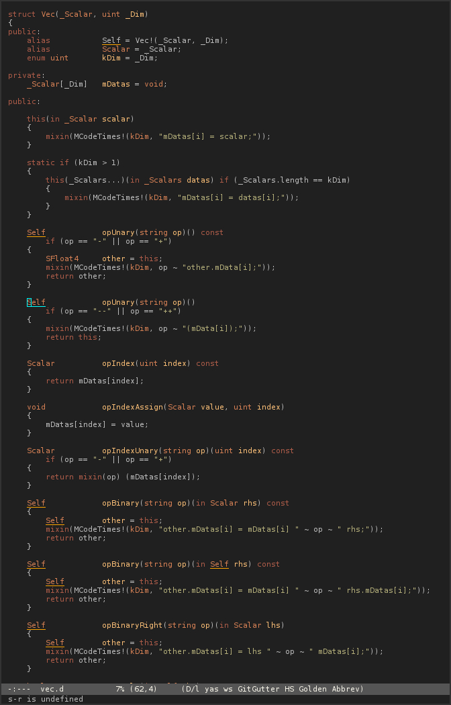

# Autumn for Emacs

Low contrast dark theme for emacs, inspired by autumn.

* Dark
* Low contrast
* Meaningful colorization:
The theme tries to highlight important tokens, and fades away most common and recognizable one.
eg: Language keywords and control structures can be easily recognized from 10m away, so their is no need to pollute the highlighting with them. On the other hand, function names and variables needs to be seen first, as they are the ones we are constantly looking for.

