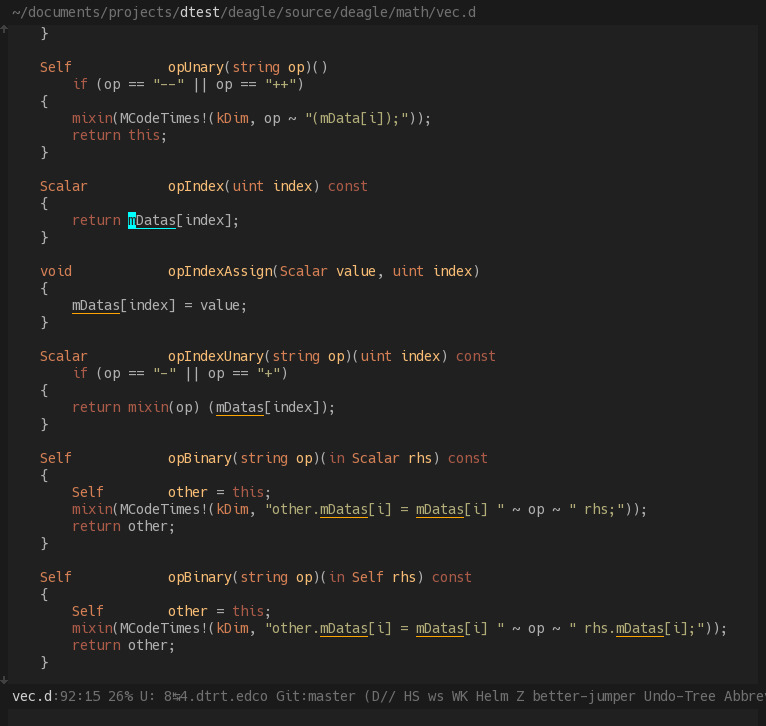

# Autumn for Emacs

Low contrast dark theme for emacs.

* Dark
* Low contrast
* Fade keywords, Highlight Names! 
  i.e.: Highlight weakly the redondant words, the ones we can easily regonize
        from habits or code structure alone (usually keywords). And highlight
        more strongly the words that are more unique to a piece of code
        (types, variables, function names etc...).

